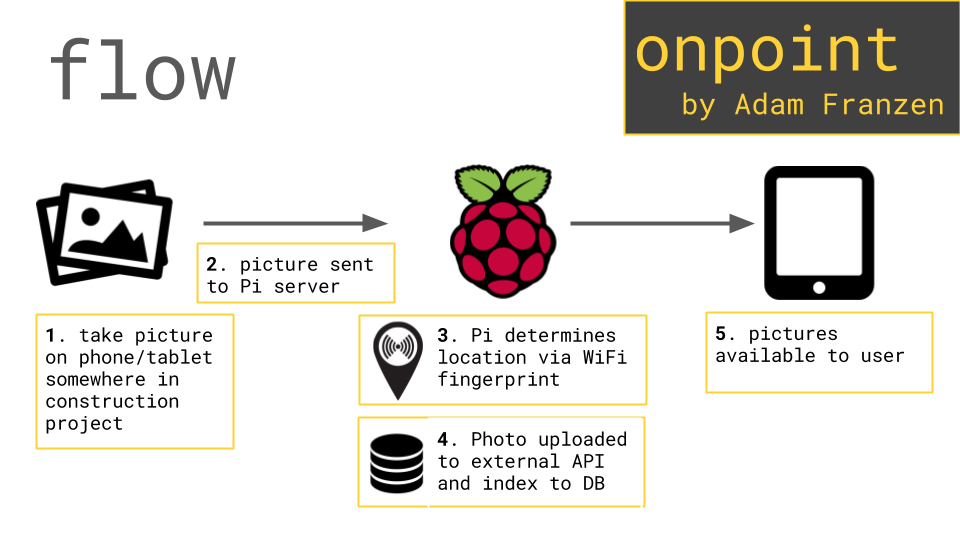

# 🚧 Welcome to the *onpoint* Github Repository! 🚧
>*Construction Done Smart*

## What is *onpoint*?
A full stack platform for construction companies, built to increase transparency and accuracy on large projects by using WiFi fingerprinting. For my capstone use-case, the user takes a photo on their phone or tablet, and *onpoint* does the rest, automatically attaching the room the picture was taken in to the picture’s metadata using machine learning. This gives each picture more significance, allowing the project team to sort pictures by area, time and other attributes for as-built documentation, progress pictures, or in the event of an insurance or financial claim.

### [Visit the Deployed Website](adamfranzen.com/onpoint)

>### Repos:
- [Client](https://github.com/apfranzen/onpoint) 🖥
- [Server](https://github.com/apfranzen/onpoint-server)
- [Pi-Server](https://github.com/apfranzen/onpoint-pi)

### How does it work?

### Additional functionality notes:

| Feature        | Status           | Notes |
| ------------- |:-------------:|:-------------:|
| offline photo storage on jobsite      | complete | |
| offline indoor positioning      | in progress | internet currently required for location services      |
| augmented reality - `Time Machine` feature | future      | |
| SLR camera support | future | additional Raspberry Pi connected to the SLR would be used to send the picture and accomplish indoor positioning |

- onpoint was designed to work on a construction jobsite with the assumption that there is no or intermittent internet:
  - The `Raspberry Pi server` is inexpensive and is intended to be left on the job site in a weatherproof enclosure. The photos will be transmitted from the phone or tablet over the same WiFi that is being used for location purposes.
  - Periodically, the `Raspberry Pi server` (*e.g. once a week*) should be connected to the internet, typically at the job site office, to upload the pictures.

### Languages and Frameworks Used

- [Raspberry Pi](https://www.raspberrypi.org/)
- [AngularJS](https://angularjs.org/)
- [Express](http://expressjs.com/)
- [PostgreSQL](PostgreSQL)
- [Knex.js](http://knexjs.org/)
- [Axios](https://github.com/mzabriskie/axios)
- [Request-Promise](https://github.com/request/request-promise)
- [HTML5](https://developer.mozilla.org/en-US/docs/Web/HTML)
- [CSS3](https://developer.mozilla.org/en-US/docs/Web/CSS)
- [Bootstrap](http://getbootstrap.com/)

_________
## Quickstart
>running this project locally

#### Client

1. git clone or fork this repo
2. run `npm install` in the terminal.
3. run `gulp` in the Terminal/Command Line
4. copy and paste `http://localhost:8888` to your browser

#### Server

1. git clone or fork this repo
2. run `npm install` in the terminal.
3. run `gulp` in the Terminal/Command Line
4. copy and paste `http://localhost:3000` to your browser
